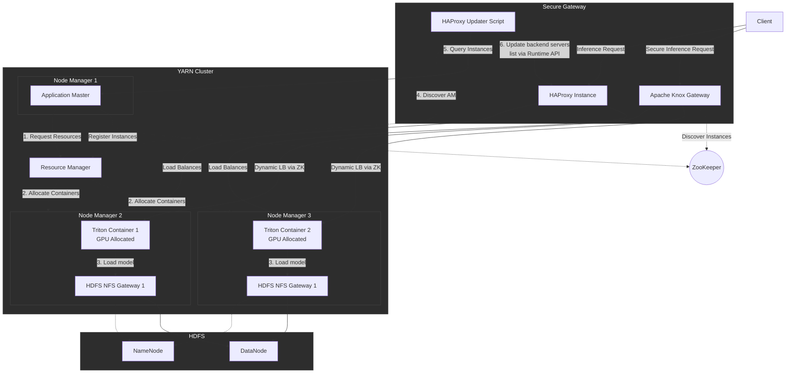

# TARN: Triton on YARN

TARN is a scalable inference solution for running NVIDIA Triton Inference Server on a Hadoop/YARN cluster using Docker containers.

## Architecture



The architecture is based on a native YARN application consisting of:
- **YARN Client**: Submits the application to the cluster.
- **Application Master (AM)**: Manages the lifecycle of Triton containers, handles auto-scaling, and exposes a list of active instances.
- **Triton Containers**: Docker instances running Triton Inference Server.
- **HAProxy**: Entry point for clients, dynamically updated via its Runtime API.

## Features

- Native YARN orchestration.
- Docker support for Triton.
- Horizontal auto-scaling managed by the Application Master.
- Local model loading from HDFS (pre-download before Triton starts).
- Service discovery for HAProxy.
- **Monitoring Dashboard**: Web UI exposed by the AM to monitor cluster status, containers, and models (available at `http://AM_HOST:AM_PORT/dashboard`).
- **Prometheus Metrics**: Aggregated metrics endpoint for Grafana (available at `http://AM_HOST:AM_PORT/metrics`).
- **Distributed Inference**: Support for multi-GPU inference using Tensor Parallelism (TP) and Pipeline Parallelism (PP).
- **Anti-Affinity**: Ensures that YARN places at most one Triton container per node for optimal performance and isolation.
- **ZooKeeper Integration**: Application Master registers Triton instances in ZooKeeper for dynamic discovery by Apache Knox.
- **Apache Ranger Integration**: Centralized authorization for model access.
- **High Availability**: Support for Application Master restart, recovering active containers from previous attempts.
- **Health Monitoring**: Integrated health checks using Triton's `/v2/health/ready` endpoint.
- **Secret Management**: Support for JKS/JCEKS secret files on HDFS for sensitive data. 
    - The `huggingface.token` alias is automatically mapped to `HUGGING_FACE_HUB_TOKEN`.
    - Any alias starting with `tarn.env.` is automatically mapped to an environment variable (e.g., `tarn.env.AWS_SECRET_KEY` becomes `AWS_SECRET_KEY`).
- **Model Storage**: Support for HDFS (with automatic copy) or NFS (direct access via NFS Gateway).
- Support for Open Inference Protocol (OIP).

## Model Repository Storage

TARN supports two ways to provide the model repository to Triton:

### 1. HDFS (Copy to Local)
If your model repository path starts with `hdfs:///`, TARN will automatically copy the models from HDFS to a local directory (`/models`) inside the container before starting Triton.
- **Pros**: Easy to set up, no extra configuration on nodes.
- **Cons**: High latency on startup for large models, consumes local disk space.

### 2. NFS (Direct Access - Recommended)
If your path starts with `/`, TARN will use the path directly. This is the recommended method for performance, as it avoids data copying. However, it requires an **NFS Gateway** to be installed and mounted on all NodeManagers.
- **Pros**: Instant startup, no data duplication.
- **Cons**: Requires NFS infrastructure.

#### How to install HDFS NFS Gateway

To use the NFS method, you must deploy an HDFS NFS Gateway on your DataNodes and mount it locally.

1. **Configure HDFS for NFS**:
   Add the following to `core-site.xml`:
   ```xml
   <property>
     <name>hadoop.proxyuser.hdfs.groups</name>
     <value>*</value>
   </property>
   <property>
     <name>hadoop.proxyuser.hdfs.hosts</name>
     <value>*</value>
   </property>
   ```

2. **Start the NFS Gateway**:
   On each DataNode (or dedicated nodes):
   ```bash
   # Start portmap (requires root)
   hdfs portmap
   # Start nfs3
   hdfs nfs3
   ```

3. **Mount HDFS via NFS**:
   On all NodeManagers:
   ```bash
   mkdir -p /mnt/hdfs
   mount -t nfs -o vers=3,proto=tcp,nolock,noacl <NFS_GATEWAY_HOST>:/ /mnt/hdfs
   ```

Now you can point TARN to your models using the local mount path:
`--model-repository /mnt/hdfs/user/models/my-model`

## Prerequisites

### 1. Hadoop Cluster Requirements
- **Hadoop 3.3+**: Required for native Docker support and Placement Constraints.
- **YARN Docker Runtime**: Must be enabled and configured on all NodeManagers.
  - In `yarn-site.xml`, ensure `yarn.nodemanager.container-executor.class` is set to `org.apache.hadoop.yarn.server.nodemanager.LinuxContainerExecutor`.
  - Docker must be an allowed runtime: `yarn.nodemanager.runtime.linux.allowed-runtimes` should include `docker`.
  - The Triton image must be whitelisted in `yarn-site.xml` (`yarn.nodemanager.runtime.linux.docker.allowed-container-networks` and associated registries).
- **Linux Container Executor**: Requires a properly configured `container-executor.cfg` on all nodes, with a `[docker]` section defined.

### 2. GPU and NVIDIA Environment
- **NVIDIA Drivers**: Installed on all NodeManagers hosting GPUs.
- **NVIDIA Container Toolkit**: Installed and configured as the default runtime for Docker on NodeManagers.
- **YARN GPU Scheduling**:
  - `yarn.io/gpu` must be defined as a resource type in `resource-types.xml`.
  - The `DominantResourceCalculator` must be used in the scheduler configuration (e.g., `capacity-scheduler.xml`).
  - NodeManagers must be configured to discover and report GPUs (using `yarn.nodemanager.resource-plugins` and `yarn.nodemanager.resource-plugins.gpu.path-to-discovery-executables`).

### 3. Development and Runtime Tools
- **Java 17**: Required for building and running the Application Master.
- **Maven**: For building the project.
- **socat**: Required on the node running the HAProxy update script (if using Option 2).
- **ZooKeeper**: Required for service registration and Knox discovery (if using Option 1 - Recommended).

### 4. Network and Permissions
- **Connectivity**: The Application Master must be able to reach NodeManagers on the Triton HTTP/GRPC ports and metrics ports.
- **Permissions**: The user submitting the YARN application must have permissions to launch Docker containers via the Linux Container Executor.

## Build

Standard build using default Maven repositories:

```bash
mvn clean package
```

### Building with Enterprise Distributions (ODP by Clemlab, Cloudera...)

If you are using enterprise distributions like **ODP** (Open Source Data Platform) by **Clemlab**, or **Cloudera**, you need to configure specific Maven repositories to fetch the distribution-specific Hadoop binaries.

#### 1. Configure Repositories

Add the ODP public repository to your `pom.xml` or your `~/.m2/settings.xml`:

```xml
<repositories>
    <repository>
        <id>odp-public</id>
        <url>https://repo.opensourcedataplatform.com/repository/maven-public/</url>
    </repository>
</repositories>
```

#### 2. Specify Distribution Version

You should align the `hadoop.version` with your distribution's version. You can do this by overriding the property during the build:

```bash
mvn clean package -Dhadoop.version=3.3.6.1.2.4.0-32
```

#### 3. Testing with Distribution Binaries

To run tests using the distribution-specific dependencies:

```bash
mvn test -Dhadoop.version=3.3.6.1.2.4.0-32
```

## Deployment

To submit the application to YARN:

```bash
yarn jar target/tarn-orchestrator-0.0.1-SNAPSHOT.jar varga.tarn.yarn.Client \
  --model-repository [model_path] \
  --image [triton_image] \
  --port [triton_port] \
  --metrics-port [metrics_port] \
  --am-port [am_port] \
  --address [bind_address] \
  --token [security_token] \
  --tp [tensor_parallelism] \
  --pp [pipeline_parallelism] \
  --secrets [hdfs_jks_path] \
  --placement-tag [tag] \
  --scale-up [threshold] \
  --scale-down [threshold] \
  --min-instances [count] \
  --max-instances [count] \
  --cooldown [ms] \
  --jar [local_jar_path] \
  --env KEY1=VALUE1 --env KEY2=VALUE2
```

Example:
```bash
yarn jar target/tarn-orchestrator-0.0.1-SNAPSHOT.jar varga.tarn.yarn.Client \
  --model-repository hdfs:///user/models \
  --image nvcr.io/nvidia/tritonserver:24.09-py3 \
  --port 8000 \
  --metrics-port 8002 \
  --am-port 8888 \
  --address 0.0.0.0 \
  --token my-secret-token \
  --tp 2 \
  --pp 1 \
  --secrets hdfs:///user/secrets/hf.jceks \
  --placement-tag nvidia \
  --scale-up 0.8 \
  --scale-down 0.2 \
  --min-instances 2 \
  --max-instances 8 \
  --cooldown 120000 \
  --jar target/tarn-orchestrator-0.0.1-SNAPSHOT.jar \
  --env TRITON_LOG_VERBOSE=1
```

## Node Tagging and Placement

TARN uses YARN **Placement Constraints** to ensure optimal distribution of Triton instances. By default, it uses the tag `nvidia` for anti-affinity (at most one container per node).

### How to tag nodes in YARN

To use placement constraints effectively, you may want to tag your nodes. In YARN, this is typically done using **Node Labels** or by configuring the NodeManagers.

#### 1. Using Node Labels (Recommended for GPU isolation)
Node labels allow you to partition the cluster. For example, to label nodes with GPUs:
```bash
# Add the label
yarn rmadmin -replaceLabelsOnNode "node1:8041,GPU node2:8041,GPU"
```
Then, you can configure your queue to use these labels. Note that TARN also explicitly requests `yarn.io/gpu` resources.

#### 2. Anti-Affinity via Placement Constraints
TARN automatically handles anti-affinity. If you use the `--placement-tag` option, TARN will:
1. Tag all its Triton containers with this value.
2. Tell YARN to never place two containers with the same tag on the same host.

This ensures that even if you have multiple GPUs on a single node, a single Triton instance (which can manage multiple GPUs via TP/PP) will occupy that node, preventing resource contention between multiple Triton processes.

## Load Balancing Options

TARN provides two distinct strategies for service discovery and load balancing, allowing you to choose the best fit for your infrastructure. **The ZooKeeper-based approach with Apache Knox is highly recommended for production environments.**

### Comparison and Recommendation

| Feature | Apache Knox + ZooKeeper (Recommended) | HAProxy + Update Script |
|:---|:---|:---|
| **Primary Use Case** | Production, Multi-tenant clusters | Standalone, Simple environments |
| **Discovery Mechanism** | Native ZK Watches (Push-based) | AM Polling via Script (Pull-based) |
| **Security** | Kerberos, LDAP, Knox Dispatchers, Audit | Basic Token-based Discovery |
| **High Availability** | Built-in via Knox HaProvider | Requires External Script Management |
| **Complexity** | Higher (requires Knox & ZooKeeper) | Lower (requires HAProxy & socat) |

### Option 1: Apache Knox with ZooKeeper (Recommended)

This method leverages **Apache ZooKeeper** for real-time service discovery and **Apache Knox** as a secure perimeter gateway. 

#### How it Works:
1.  **Ephemeral Registration**: The TARN Application Master (AM) automatically registers every new Triton container as an **ephemeral znode** in ZooKeeper under the configured path (e.g., `/services/triton/instances/container_id`).
2.  **Liveness Monitoring**: If a container fails or is stopped by YARN, its znode is automatically removed from ZooKeeper by the cluster coordination.
3.  **Dynamic Discovery**: Apache Knox uses its `HaProvider` to watch the ZooKeeper namespace. As soon as a znode appears or disappears, Knox updates its internal list of backends without any manual intervention.
4.  **Secure Proxying**: Clients interact with Knox via HTTPS. Knox handles authentication (LDAP, Kerberos) and then forwards requests to the healthy Triton instances.

#### 1. AM Configuration for ZooKeeper

When submitting the application, provide the ZooKeeper ensemble and the base path where instances should register:

```bash
yarn jar tarn-orchestrator.jar varga.tarn.yarn.Client \
  ... \
  --zk-ensemble zk-host1:2181,zk-host2:2181 \
  --zk-path /services/triton/instances
```

#### 2. Knox Topology Configuration

Create a topology file (e.g., `/etc/knox/conf/topologies/tarn.xml`) and enable the `HaProvider`. This provider is responsible for talking to ZooKeeper and performing round-robin load balancing.

```xml
<topology>
    <gateway>
        <provider>
            <role>ha</role>
            <name>HaProvider</name>
            <enabled>true</enabled>
            <param>
                <name>TRITON</name>
                <value>
                    enabled=true;
                    maxFailoverAttempts=3;
                    failoverSleep=1000;
                    zookeeperEnsemble=zk-host1:2181,zk-host2:2181;
                    zookeeperNamespace=/services/triton
                </value>
            </param>
        </provider>
        <!-- Add your ShiroProvider or Kerberos authentication here -->
    </gateway>
    <service>
        <role>TRITON</role>
        <!-- No URL is needed here as it is discovered via ZooKeeper -->
    </service>
</topology>
```

---

### Option 2: HAProxy with Dynamic Update Script

This method is suitable for smaller deployments or environments where Apache Knox is not available. It relies on a sidecar script that polls the TARN Application Master.

#### How it Works:
1.  **AM Discovery**: The `update_haproxy.sh` script uses the YARN CLI to find the current host and port of the Application Master.
2.  **Instance Polling**: Every 30 seconds (configurable), the script queries the AM's `/instances` endpoint to get the list of active Triton containers.
3.  **Runtime API Update**: The script communicates with HAProxy via a Unix Socket using `socat`. It uses the **Runtime API** to update server addresses and ports in real-time.
4.  **Slot Management**: HAProxy must be configured with "placeholder slots". The script maps active containers to these slots. Unused slots are put into `MAINT` (maintenance) mode to stop traffic.

#### 1. HAProxy Installation

Ensure both HAProxy and `socat` are installed on the load balancer node:

```bash
# Ubuntu/Debian
sudo apt-get install haproxy socat
# RHEL/CentOS
sudo yum install haproxy socat
```

#### 2. HAProxy Configuration

Edit `/etc/haproxy/haproxy.cfg`. You **must** enable the stats socket with `level admin` to allow the script to make changes.

```haproxy
global
    # Mandatory for the update script
    stats socket /var/run/haproxy.sock mode 660 level admin
    stats timeout 30s

defaults
    mode http
    timeout connect 5s
    timeout client 50s
    timeout server 50s

frontend triton_frontend
    bind *:80
    default_backend triton_backend

backend triton_backend
    balance roundrobin
    # Define placeholder slots. 
    # Important: The number of slots must be >= your --max-instances setting.
    server triton-1 0.0.0.0:8000 check disabled
    server triton-2 0.0.0.0:8000 check disabled
    server triton-3 0.0.0.0:8000 check disabled
    server triton-4 0.0.0.0:8000 check disabled
```

#### 3. Permissions and Script Usage

The user running the script needs write access to the HAProxy socket:

```bash
sudo chown root:haproxy /var/run/haproxy.sock
sudo chmod 660 /var/run/haproxy.sock
sudo usermod -a -G haproxy $USER
```

Run the script in the background or as a systemd service:

```bash
./scripts/update_haproxy.sh /var/run/haproxy.sock <YOUR_TARN_TOKEN>
```

#### 5. Running as a Service

A systemd unit file is provided in `services/tarn-haproxy-updater.service`. To install it:
1. Copy the script to `/usr/local/bin/update_haproxy.sh`.
2. Copy the service file to `/etc/systemd/system/`.
3. Update the `ExecStart` and `User` in the service file if necessary.
4. Run `systemctl daemon-reload && systemctl enable --now tarn-haproxy-updater`.

## Security

TARN implements several security features:
- **API Token**: The Application Master can be configured with a token to secure the service discovery endpoint.
- **Dynamic Discovery**: Eliminates the need to hardcode IP addresses, reducing exposure.
- **YARN Isolation**: Leverages YARN's multi-tenancy and Docker isolation.
- **Apache Ranger**: Provides centralized model-level authorization, ensuring that users can only discover and use models they are explicitly permitted to access.
- **Kerberos Support**: Compatible with secured Hadoop clusters (ensure the discovery script has a valid ticket).

### Apache Ranger Integration

TARN integrates with **Apache Ranger** to provide fine-grained access control at the model level. This ensures that users only see and interact with the models they are authorized to use.

#### 1. Create Ranger Service Definition

Before you can define policies, you must register the `triton` service definition in Ranger Admin.

1.  Use the following JSON to create a file named `triton-service-def.json`:
    ```json
    {
      "name": "triton",
      "id": 1001,
      "resources": [
        {
          "name": "model",
          "level": 1,
          "parent": "",
          "mandatory": true,
          "lookupSupported": true,
          "recursiveSupported": false,
          "matcher": "org.apache.ranger.plugin.resourcematcher.RangerDefaultResourceMatcher",
          "matcherOptions": { "wildCard": true, "ignoreCase": true },
          "label": "Triton Model",
          "description": "Triton Model Name"
        }
      ],
      "accessTypes": [
        { "name": "infer", "label": "Inference" },
        { "name": "metadata", "label": "Metadata" },
        { "name": "list", "label": "List" }
      ],
      "contextEnrichers": [],
      "policyConditions": []
    }
    ```
2.  Register the service type using the Ranger REST API:
    ```bash
    curl -u admin:password -X POST -H "Content-Type: application/json" \
      http://<RANGER_ADMIN_HOST>:6080/service/plugins/definitions \
      -d @triton-service-def.json
    ```
3.  In the Ranger Admin UI, create a new service instance (e.g., named `triton_prod`) using the newly created `triton` service type.

#### 2. Enable Ranger in TARN

To enable Ranger, you must provide the Ranger service name when submitting the application:

```bash
yarn jar tarn-orchestrator.jar varga.tarn.yarn.Client \
  ... \
  --ranger-service triton_prod \
  --ranger-app-id tarn \
  --ranger-audit
```

**Options:**
- `--ranger-service` (`-rs`): The name of the service instance defined in Ranger Admin.
- `--ranger-app-id` (`-ra`): The application ID for Ranger (default: `tarn`).
- `--ranger-audit` (`-raudit`): Enable auditing of access requests in Ranger.

**Environment Variables:**
- `RANGER_SERVICE`
- `RANGER_APP_ID`
- `RANGER_AUDIT`

#### 3. Ranger Service Definition Details

The service definition (registered in step 1) includes the following resources and access types:

- **Resource**: `model` (The name of the inference model).
- **Access Types**:
  - `infer`: Permission to run inference requests.
  - `metadata`: Permission to view model configuration/metadata.
  - `list`: Permission to see the model in the discovery list and dashboard.

A complete JSON service definition is available in `SPEC Ranger.md`.

#### 4. How it Works

1.  **Identity Propagation**: When accessing the AM Dashboard or API, TARN identifies the user via Kerberos or the `X-TARN-User` header.
2.  **Authorization and Auditing**: For every model available in the HDFS repository, TARN queries the Ranger plugin to check if the user has `list` permission. If `--ranger-audit` is enabled, these access attempts are logged to the configured Ranger audit destination.
3.  **Dynamic Filtering**: Models for which the user does not have permission are automatically filtered out from the Dashboard and service discovery results.
    - `list` permission is required to see models in the HDFS list.
    - `metadata` permission is required to see details of loaded models.

#### 5. Authorization API
TARN provides a REST API to check model-level permissions. This can be used by external gateways (like Apache Knox) to enforce security for inference requests.

- **Endpoint**: `http://<AM_HOST>:<AM_PORT>/authorize?model=<name>&action=<action>`
- **Query Parameters**:
  - `model`: The model name.
  - `action`: The access type (`infer`, `metadata`, or `list`).
  - `user`: (Optional) The user to check (defaults to the requester).
- **Response**: `true` or `false`.

Example:
```bash
curl -H "X-TARN-Token: my-token" \
  "http://am-host:8888/authorize?model=resnet50&action=infer&user=alice"
```

#### 6. Audit Configuration

To enable auditing, the following conditions must be met:
1. The `--ranger-audit` flag must be set.
2. A `ranger-triton-audit.xml` configuration file must be present in the Application Master's classpath. This file defines where the audits are sent (e.g., Solr, HDFS, or Log4j).

Example `ranger-triton-audit.xml`:
```xml
<configuration>
    <property>
        <name>xasecure.audit.is.enabled</name>
        <value>true</value>
    </property>
    <property>
        <name>xasecure.audit.destination.log4j</name>
        <value>true</value>
    </property>
    <property>
        <name>xasecure.audit.destination.log4j.logger</name>
        <value>ranger.audit</value>
    </property>
</configuration>
```

#### 7. Knox Authorization Integration

Apache Knox can be configured to act as a **Policy Enforcement Point (PEP)** by leveraging the TARN Authorization API or by using the Ranger Knox Plugin.

**Using the Authorization API in Knox:**
1.  **Service Definition**: Define a Knox service for Triton that captures the model name from the URL (e.g., `/v2/models/{model}/infer`).
2.  **Authorization Check**: Configure Knox (or a custom dispatcher) to call the TARN AM `/authorize` endpoint before routing the request:
    ```bash
    # Check if alice is allowed to infer on resnet50
    GET http://<AM_HOST>:<AM_PORT>/authorize?model=resnet50&action=infer&user=alice
    ```
3.  **Propagation**: Knox should propagate the original user identity using the `X-TARN-User` header when talking to the AM for authorization checks.

**Using the Ranger Knox Plugin:**
Alternatively, you can install the `ranger-knox-plugin` on your Knox gateway and configure it to use the `triton` service definition. This allows Knox to check policies directly against the Ranger Admin server, providing the same level of security as the TARN Application Master but at the edge of the cluster.

Example Knox Topology with Ranger Authorization:
```xml
<topology>
    <gateway>
        <provider>
            <role>authentication</role>
            <name>ShiroProvider</name>
            <enabled>true</enabled>
            <!-- LDAP/PAM config -->
        </provider>
        <provider>
            <role>authorization</role>
            <name>XASecurePDPKnox</name>
            <enabled>true</enabled>
        </provider>
    </gateway>
    <service>
        <role>TRITON</role>
    </service>
</topology>
```

You can include the directory containing this file in the `CLASSPATH` or use the `--env` option to pass configuration properties if supported by the Ranger version.

## Usage Examples (Open Inference Protocol)

Below are examples of how to consume the inference service using the **Open Inference Protocol** (via the `tritonclient` Python library). These examples assume you are targeting the HAProxy endpoint or a direct Triton instance.

To use Triton, we need to build a model repository. The Triton Inference Server organizes models in a model repository, which is a structured directory containing models and their configurations.


The structure of the repository as follows:

The repository follows a specific layout:

```
<model-repository-path>/
   <model-name>/
       [config.pbtxt]
       [<output-labels-file> ...]
       [configs/]
           [<custom-config-file> ...]
       <version>/
           <model-definition-file>
       <version>/
           <model-definition-file>
```

- Model Name: Each subdirectory under the repository represents a model.

- config.pbtxt: This optional file defines the model's configuration, including backend, input/output shapes, and data types. If not provided, Triton may auto-generate it for supported backends.

- Version Directories: Each model must have at least one numerically named subdirectory (e.g., 1, 2), representing different versions of the model. Non-numeric directories are ignored.

- Model Definition Files: These are backend-specific files (e.g., model.onnx for ONNX, model.pt for PyTorch, model.plan for TensorRT).

Example:

```
model_repository
|
+-- resnet50
    |
    +-- config.pbtxt
    +-- 1
        |
        +-- model.pt
+-- densenet_onnx
    |
    +-- config.pbtxt
    +-- 1
        |
        +-- model.onnx   
```

The config.pbtxt configuration file is optional. The configuration file is autogenerated by Triton Inference Server if the user doesn’t provide it. The config.pbtxt file specifies key details such as:

- Backend: Defines the framework (e.g., TensorFlow, PyTorch, ONNX).
- Inputs/Outputs: Specifies names, shapes, and data types.
- Batching: Configures maximum batch size and dynamic batching policies.

Example config.pbtxt for an ONNX model:

```
name: "text_detection"
backend: "onnxruntime"
max_batch_size: 256
input [
   {
       name: "input_images:0"
       data_type: TYPE_FP32
       dims: [ -1, -1, -1, 3 ]
   }
]
output [
   {
       name: "feature_fusion/Conv_7/Sigmoid:0"
       data_type: TYPE_FP32
       dims: [ -1, -1, -1, 1 ]
   }
]
```

Triton supports multiple versions of a model within the same repository. Each version resides in its own directory (e.g., 1/, 2/). By default, Triton serves the latest version, but this behavior can be customized using version policies.

### 1. Stable Diffusion (Image Generation)

To deploy Stable Diffusion, you need to have the model repository structured correctly.
```bash
yarn jar target/tarn-orchestrator-0.0.1-SNAPSHOT.jar varga.tarn.yarn.Client \
  --model-repository hdfs:///models \
  --image nvcr.io/nvidia/tritonserver:24.09-py3 \
  --token secret-token
```

**Client Code (Python):**
```python
import numpy as np
from PIL import Image
from tritonclient.http import InferenceServerClient, InferInput

# Connect to the server (HAProxy or direct instance)
client = InferenceServerClient(url="localhost:8000")

prompt = "A futuristic city in the style of cyberpunk"
input_data = np.array([prompt], dtype=object)

# Setup inputs according to the model configuration
inputs = [InferInput("PROMPT", [1], "BYTES")]
inputs[0].set_data_from_numpy(input_data)

# Run inference
response = client.infer("stable_diffusion", inputs)

# Extract and save the generated image
image_data = response.as_numpy("IMAGES")[0]
image = Image.fromarray(image_data.astype(np.uint8))
image.save("generated_image.png")
```

### 2. ONNX Model (Quick Deploy)

Deploying an ONNX model (e.g., ResNet-50):
```bash
yarn jar target/tarn-orchestrator-0.0.1-SNAPSHOT.jar varga.tarn.yarn.Client \
  --model-repository hdfs:///models \
  --image nvcr.io/nvidia/tritonserver:24.09-py3
```

**Client Code (Python):**
```python
import numpy as np
import tritonclient.http as httpclient

client = httpclient.InferenceServerClient(url="localhost:8000")

# Prepare dummy input data (e.g., for ResNet-50)
input_shape = (1, 3, 224, 224)
data = np.random.randn(*input_shape).astype(np.float32)

inputs = [httpclient.InferInput("input_0", input_shape, "FP32")]
inputs[0].set_data_from_numpy(data)

# Request inference
results = client.infer("onnx_resnet50", inputs)

# Get output
output_data = results.as_numpy("output_0")
print(f"Inference result shape: {output_data.shape}")
```

### 3. PyTorch Model (LibTorch)

For PyTorch models, ensure the model is exported as TorchScript and stored in the repository:
```bash
yarn jar target/tarn-orchestrator-0.0.1-SNAPSHOT.jar varga.tarn.yarn.Client \
  --model-repository hdfs:///models \
  --image nvcr.io/nvidia/tritonserver:24.09-py3
```

**Client Code (Python):**
```python
import numpy as np
import tritonclient.http as httpclient

client = httpclient.InferenceServerClient(url="localhost:8000")

# Example input for an image classification model
data = np.random.randn(1, 3, 224, 224).astype(np.float32)

inputs = [httpclient.InferInput("INPUT__0", [1, 3, 224, 224], "FP32")]
inputs[0].set_data_from_numpy(data)

# Call Triton
response = client.infer("pytorch_densenet", inputs)

# Parse output
probabilities = response.as_numpy("OUTPUT__0")
predicted_class = np.argmax(probabilities)
print(f"Predicted class ID: {predicted_class}")
```

## Monitoring with Grafana

You can connect Grafana to the Application Master by adding a Prometheus data source pointing to:
`http://<AM_HOST>:<AM_PORT>/metrics?token=<YOUR_TOKEN>`

Available metrics:
- `tarn_target_containers`: Target number of containers for scaling.
- `tarn_running_containers`: Actual number of running containers.
- `tarn_container_load`: Per-container load based on GPU or request activity.
- `tarn_gpu_utilization`: Per-GPU utilization.
- `tarn_gpu_memory_used`: Per-GPU memory usage.
